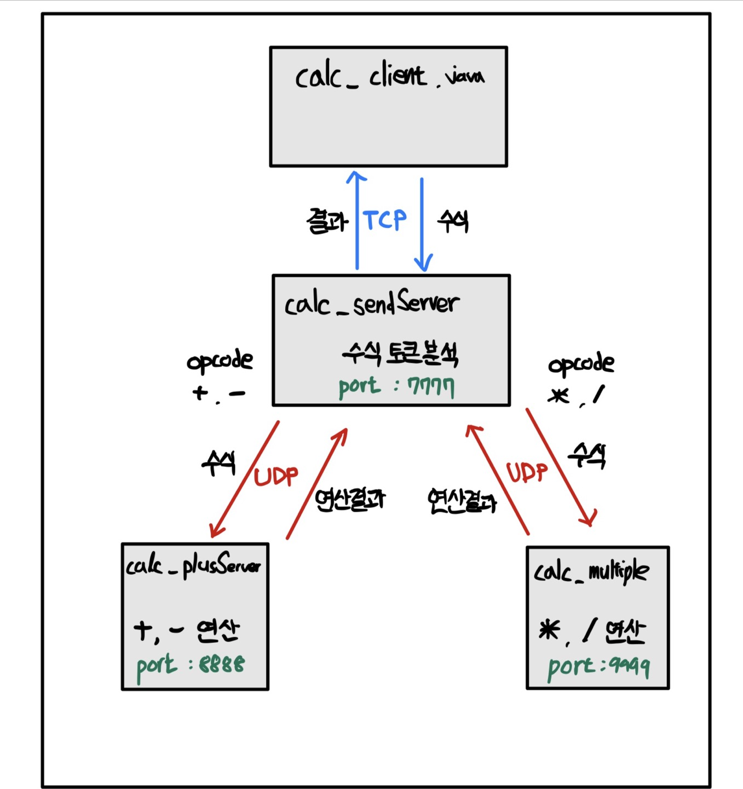

# Java network programming

 

## Programming List

 

### 1. socketTcpUdp

- 컴퓨터 네트워크 과목 첫번째 프로젝트
- 계산기 클라이언트 1개 + 서버 3개 간 통신
- 반드시, 서버를 먼저 열고 클라이언트를 열어야 함. 서버가 열려있지 않으면 서버 단에서 TCP 통신을 위한 서버 소켓이 열려있지 않다는 오류 반환됨

 

#### 1.1 calc_client
- 사용자로부터 수식 입력 받고 sendServer로 전달
- 서버 단에서 StringTokenizer를 이용해서 수식 분석하기에 정확한 입력 필요

 

#### 1.2 calc_sendServer
- client에서 받은 수식을 보고 토큰 분석 이후 `+, -`이면 calc_plusServer로 전송, `*, /`이면 calc_multipleServer로 전송

 

#### 1.3 calc_plusServer
- sendServer에서 받은 op1, opcode, op2를 `+, -` 연산 

 

#### 1.4 calc_multipleServer
- sendServer에서 받은 op1, opcode, op2를 `*, /` 연산

 

#### 동작 원리

</img>

 

`calc_client`와 `calc_sendServer`는 TCP 통신, `calc_sendServer`와 `calc_plusServer, calc_multipleServer`는 UDP 통신을 이용

 

TCP는 연결 이후에 통신하는 1:1 통신 방식이라서 데이터의 전송 순서가 보장되고, 데이터가 손실되면 재전송이 되고, 패킷을 관리하지 않아도 되는 신뢰성 있는 데이터를 전송한다는 특징이 있다.

 

UDP는 연결을 하지 않는 비 연결기반 통신이라서 1:1 통신, 1:n 통신, n:n 통신이 가능하다. 데이터의 전송 순서가 바뀔 수도 있으며, 패킷을 관리해주어야 하지만 TCP보다 전송속도가 빠르다는 특징이 있다.

 

본인은 TCP 방식을 전화기에 비유했고 UDP 방식을 소포에 비유했다. client와 sendServer가 1:1로 전화를 하여 수식을 전달하고 답을 받는 과정이라고 생각하여 TCP 방식을 적용하였다.

 

이제 sendServer의 입장에서 plusServer와 multipleServer와 소통할 때, sendServer는 수식을 소포로 plusServer와 multipleServer에 던져버리는 1:n 통신, 그리고 각각의 계산 서버에서 다시 sendServer로 수식에 대한 결과 소포를 던져버리는 (각각의 입장에서 1:1 통신)이 된다고 생각하여 UDP 방식을 적용하였다.

 

client와 sendServer는 수식과 결과라는 중요한 데이터를 주고받아야 해서 신뢰성 있는 연결이 필요하여 tcp 방식, 각각의 계산 서버는 빠르게 연산하여 답을 반환하도록 udp 방식이라는 관점에서도 적용하였다.

 

### 2. securitySymmetric
- 네트워크 보안 과목 첫번째 프로젝트
- 클라이언트에서 `example.txt`를 암호화하여 키와 암호문을 서버에 전송
- 기본적인 통신방법은 UDP 소켓 통신을 이용하였음
- 암호화 방식은 DES/Triple DES/AES를 이용하였고 각각에서 ECB모드, CBC모드를 사용함

 

#### 2.1 des_3des_aes_Client
- 먼저 서버에 example.txt를 UDP 통신으로 보냄
- 이후, 사용자로부터 사용할 암호화 방식을 입력받음 (DES/3DES/AES). 입력받은 문자를 서버로 전송함
- 입력받은 암호화 방식으로 암호화 시작. 이때 ECB모드, CBC모드를 사용함
- 암호화 된 암호문과 키를 des_3des_aes_Server로 전송
- 단, 이때 udp 통신이기에 `byte[]` 형태로 전송해줘야 하고, key는 Base64 인코딩을 해줘야함

 

#### 2.2 des_3des_aes_Server
- 클라이언트에서 받은 example.txt를 패킷 분석하여 createFile 함수 이용하여 파일 만듬 (ReceiveFile.txt)
- 이후, 받은 패킷을 분석하여 어떤 암호화 방식인지 알아냄.
- 클라이언트에서 입력한 암호화 방식에 따라, UDP 통신하여 받은 패킷을 분석하고 암호문과 키를 저장함
- 저장한 암호문과 키를 바탕으로 복호화 시작하고 결과를 파일로 저장함

 

#### 동작원리 (프로그램)

간단히 예시를 들어서 설명하겠다. 

 

클라이언트에 접속하면 DES, 3DES, AES 세 가지 암호화 중 하나를 선택한다. 선택하면 각각의 암호화를 ECB모드, CBC모드를 이용하여 진행한다. (ex. DES 입력하면 DES ECB모드, DES CBC모드 진행)

 

클라이언트 콘솔에 DES를 입력하면 선택한 암호화인 DES가 먼저 서버로 전달된다. 이후 평문인 example.txt를 DES-ECB모드와 DES-CBC모드로 암호화한다. 암호화된 암호문과 키는 UDP 통신을 이용하여 서버로 패킷이 전달된다.

 

서버는 클라이언트에서 첫 번째로 받은 패킷을 이용하여 클라이언트가 어떤 암호화를 선택했는지 확인한다. 현재, 클라이언트에서 넘어온 패킷을 확인하면 “DES”가 넘어 왔으므로, DesDecrypt() 함수를 실행한다. DesDecrypt() 함수는 암호문과 키를
FileOutputStream을 이용한 함수인 createFile로 파일을 저장한다. 그리고 저장한 파일을 불러와서 복호화를 진행하고 복호화 된 것을 파일로 저장한다.

 

정리) 클라이언트에서 DES 입력 시 일어나는 일
 

**클라이언트**

- DES 문자를 패킷에 담아 전달
- example.txt를 패킷에 담아 전달
- DES-ECB모드 암호문, 키 전달
- DES-CBC모드 암호문, 키 전달

 

**서버**

- DES 문자를 담은 패킷 수신
- 패킷을 분석하여 전달받은 example.txt를 ReceivedFile.txt로 저장
- 전달 받은 DES-ECB모드 암호문, 키 파일로 저장
- 전달 받은 DES-CBC모드 암호문, 키 파일로 저장
- 저장된 암호문과 키를 이용하여 복호화하고 복호화 된 것을 파일로 저장

